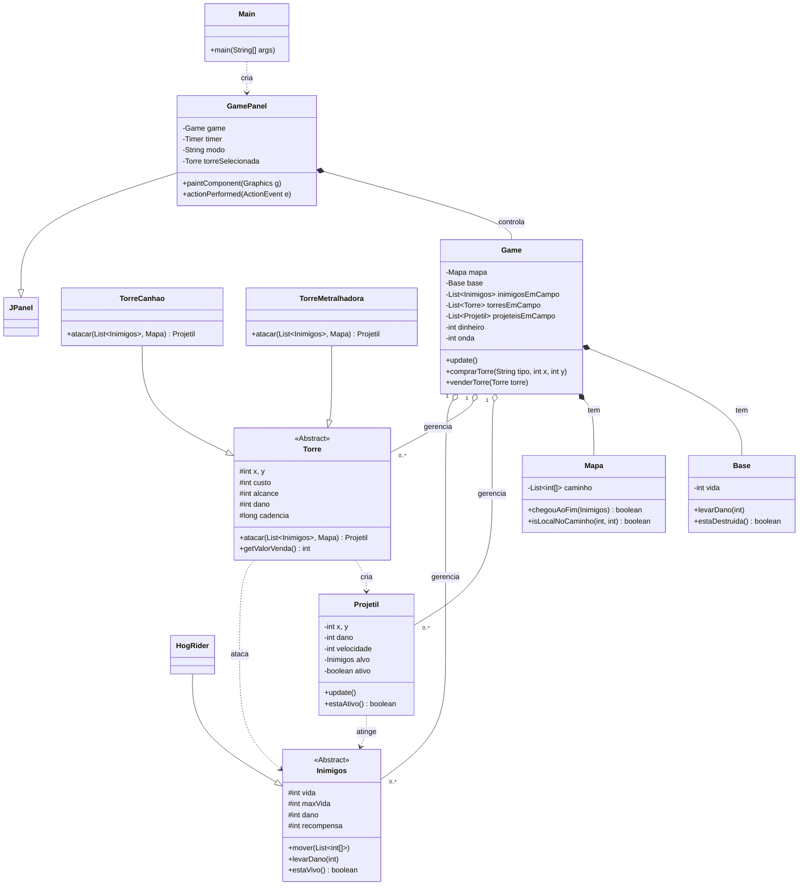

# projeto-lpoo
Projeto referente a disciplina de programação Orientada a Objetos da UPE

```mermaid
classDiagram
    class Main {
        +main(String[] args)
    }
    
    class GamePanel {
        -Game game
        -Timer timer
        -String modo
        -Torre torreSelecionada
        +paintComponent(Graphics g)
        +actionPerformed(ActionEvent e)
    }
    
    class Game {
        -Mapa mapa
        -Base base
        -List~Inimigos~ inimigosEmCampo
        -List~Torre~ torresEmCampo
        -List~Projetil~ projeteisEmCampo
        -int dinheiro
        -int onda
        +update()
        +comprarTorre(String tipo, int x, int y)
        +venderTorre(Torre torre)
    }
    
    class Torre {
        <<Abstract>>
        #int x, y
        #int custo
        #int alcance
        #int dano
        #long cadencia
        +atacar(List~Inimigos~, Mapa) Projetil
        +getValorVenda() int
    }
    
    class TorreCanhao {
        +atacar(List~Inimigos~, Mapa) Projetil
    }
    
    class TorreMetralhadora {
        +atacar(List~Inimigos~, Mapa) Projetil
    }
    
    class Inimigos {
        <<Abstract>>
        #int vida
        #int maxVida
        #int dano
        #int recompensa
        +mover(List~int[]~)
        +levarDano(int)
        +estaVivo() boolean
    }
    
    class HogRider {
    }
    
    class Projetil {
        -int x, y
        -int dano
        -int velocidade
        -Inimigos alvo
        -boolean ativo
        +update()
        +estaAtivo() boolean
    }
    
    class Mapa {
        -List~int[]~ caminho
        +chegouAoFim(Inimigos) boolean
        +isLocalNoCaminho(int, int) boolean
    }
    
    class Base {
        -int vida
        +levarDano(int)
        +estaDestruida() boolean
    }

    Main ..> GamePanel : cria
    GamePanel --|> JPanel
    GamePanel *-- Game : controla
    Game "1" o-- "0..*" Inimigos : gerencia
    Game "1" o-- "0..*" Torre : gerencia
    Game "1" o-- "0..*" Projetil : gerencia
    Game *-- Mapa : tem
    Game *-- Base : tem
    HogRider --|> Inimigos
    TorreCanhao --|> Torre
    TorreMetralhadora --|> Torre
    Torre ..> Inimigos : ataca
    Torre ..> Projetil : cria
    Projetil ..> Inimigos : atinge
```
